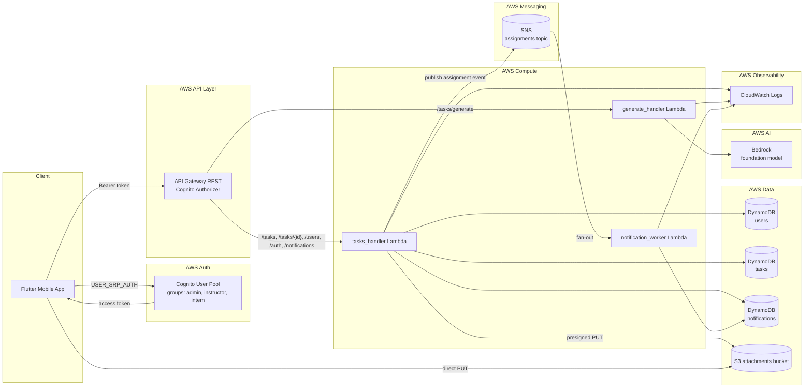

# Architecture

## Overview

InternTask AI Cloud is a serverless AWS application with a Flutter mobile client and Terraform-managed backend infrastructure.

Core services:

- Amazon Cognito User Pool and groups
- Amazon API Gateway REST API
- AWS Lambda
- Amazon DynamoDB
- Amazon S3
- Amazon SNS
- Amazon Bedrock
- Amazon CloudWatch
- IAM

## Architecture Diagram

## Runtime Flow

1. The Flutter app signs the user in with Cognito.
2. The app fetches the Cognito access token.
3. The app sends `Authorization: Bearer <access_token>` to API Gateway.
4. API Gateway validates the token with a Cognito User Pool authorizer.
5. Lambda reads Cognito claims from `requestContext.authorizer.claims`.
6. Lambda enforces role rules for `admin`, `instructor`, and `intern`.
7. Task data is stored in DynamoDB.
8. Proof uploads use a presigned S3 `PUT` URL created by Lambda.
9. Assignment events are published to SNS.
10. An SNS-subscribed notification worker Lambda writes internal notifications to DynamoDB.
11. The Flutter app polls `GET /notifications` and marks items read through `PUT /notifications/{id}/read`.
12. Bedrock is called only for AI draft generation, and instructors must still validate before creating tasks.

## Lambda Components

- `tasks_handler`
  - `POST /tasks`
  - `GET /tasks`
  - `GET /tasks/{id}`
  - `PUT /tasks/{id}`
  - `DELETE /tasks/{id}`
  - `PATCH /tasks/{id}/status`
  - `POST /tasks/{id}/comments`
  - `POST /tasks/{id}/attachment-url`
  - `GET /tasks/{id}/attachments`
  - `POST /tasks/{id}/assign`
  - `POST /auth/profile`
  - `GET /users/me`
  - `GET /users/interns`
  - `GET /notifications`
  - `PUT /notifications/{notificationId}/read`
- `generate_handler`
  - `POST /tasks/generate`
- `notification_worker`
  - consumes SNS assignment events and writes notification items

## Cognito and Roles

- `admin`
  - full administrative visibility
  - can create, generate, assign, update, delete, and track tasks
- `instructor`
  - can create, generate, assign, update, delete, and track tasks they manage
- `intern`
  - can view assigned tasks
  - can update task status
  - can comment
  - can request proof upload URLs
  - can list their notifications and mark them read

## Storage Design

- `users` table
  - Cognito-linked app metadata
- `tasks` table
  - primary task documents, inline comments, inline attachment metadata
- `notifications` table
  - intern-facing notification records, keyed by `(userId, notificationId)`
- S3 bucket
  - private proof and attachment objects with server-side encryption

## Mobile Architecture

- Amplify Auth Cognito handles sign-in and token retrieval.
- `ApiService` sends REST requests to API Gateway.
- `AppController` manages session state, task loading, AI generation, assignment, uploads, and notifications.
- `AppConfig.load()` reads `assets/config/amplify_outputs.json` and toggles preview mode when placeholders are detected.
